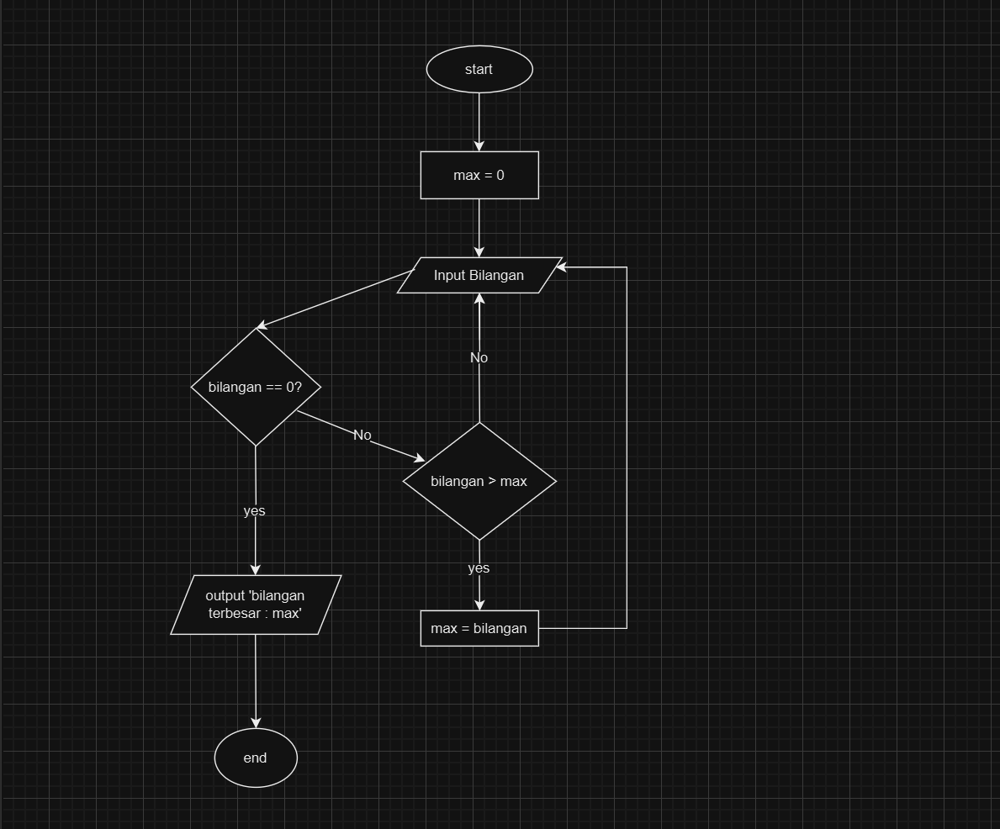

# Program Mencari Bilangan Terbesar
Program sederhana untuk mencari nilai terbesar dari sekumpulan bilangan yang dimasukkan oleh pengguna menggunakan loop while True dan break statement.
## Deskripsi Program
Program ini dibuat menggunakan bahasa Python dengan fitur:

- Menggunakan while True untuk perulangan tak terbatas
- Menggunakan break statement untuk menghentikan program
- Membandingkan setiap input dengan nilai maksimum yang tersimpan
- Menampilkan bilangan terbesar yang ditemukan

## Flowchart Programan


## kode Program
```Python
max = 0
bilangan = int(input("masukan bilangan :"))
while bilangan != 0 :
    if bilangan > max :
        max = bilangan
    bilangan = int(input("masukan bilangan :"))

print (f"bilangan terbesar= {max}")
```
## output Program
````
masukan bilangan :20
masukan bilangan :40
masukan bilangan :80 
masukan bilangan :100
masukan bilangan :750
masukan bilangan :0
bilangan terbesar= 750
````

# Cara Kerja Program
Program meminta pengguna memasukkan bilangan berulang kali. Jika bilangan lebih besar dari nilai sebelumnya, bilangan tersebut disimpan sebagai yang terbesar. Proses berhenti saat pengguna memasukkan 0, dan program mencetak bilangan terbesar yang telah dimasukkan.
