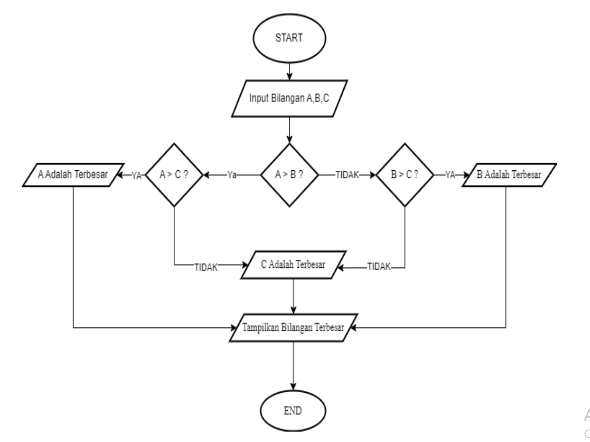

# Program Mencari Bilangan Terbesar
Program sederhana untuk mencari nilai terbesar dari sekumpulan bilangan yang dimasukkan oleh pengguna menggunakan loop while True dan break statement.
## Deskripsi Program
Program ini dibuat menggunakan bahasa Python dengan fitur:

- Menggunakan while True untuk perulangan tak terbatas
- Menggunakan break statement untuk menghentikan program
- Membandingkan setiap input dengan nilai maksimum yang tersimpan
- Menampilkan bilangan terbesar yang ditemukan

## Flowchart Program 1

## Flowchart Program 2


## Kode Program 1
```Python
a = int( input("masukan bilangan A: "))
b = int( input("masukan bilangan B: "))
c = int( input("masukan bilangan C: "))

if a > b:
    if a > c:
        print("terbesar adalah A")
        terbesar = a 
    else:
        print("terbesar adalah C")
        terbesar = c 
else:
    if b > c: 
        print("terbesar adalah B")
        terbesar = b
    else:
        print("terbesar adalah C")
        terbesar = c

print(f"bilangan terbesar adalah: {terbesar}")
```
## Output Program 1
````
masukan bilangan A: 110
masukan bilangan B: 120 
masukan bilangan C: 160
terbesar adalah C
bilangan terbesar adalah: 160
````
## kode Program 2
```Python
max = 0
bilangan = int(input("masukan bilangan :"))
while bilangan != 0 :
    if bilangan > max :
        max = bilangan
    bilangan = int(input("masukan bilangan :"))

print (f"bilangan terbesar= {max}")
```
## output Program 2
````
masukan bilangan :20
masukan bilangan :40
masukan bilangan :80 
masukan bilangan :100
masukan bilangan :750
masukan bilangan :0
bilangan terbesar= 750
````
## Cara Kerja Program 1
Program dimulai dengan meminta input tiga bilangan, yaitu A, B, dan C. Kemudian, program memeriksa apakah A lebih besar dari B; jika benar, A akan dibandingkan dengan C. Jika A lebih besar dari C, maka A adalah bilangan terbesar; jika tidak, C adalah yang terbesar. Jika A tidak lebih besar dari B, maka B akan dibandingkan dengan C. Jika B lebih besar dari C, maka B adalah bilangan terbesar; jika tidak, C adalah yang terbesar. Setelah itu, program menampilkan bilangan terbesar dan berakhir.

## Cara Kerja Program 2
Program meminta pengguna memasukkan bilangan berulang kali. Jika bilangan lebih besar dari nilai sebelumnya, bilangan tersebut disimpan sebagai yang terbesar. Proses berhenti saat pengguna memasukkan 0, dan program mencetak bilangan terbesar yang telah dimasukkan.
